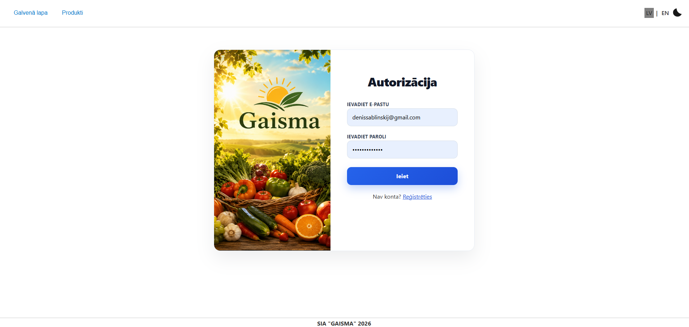
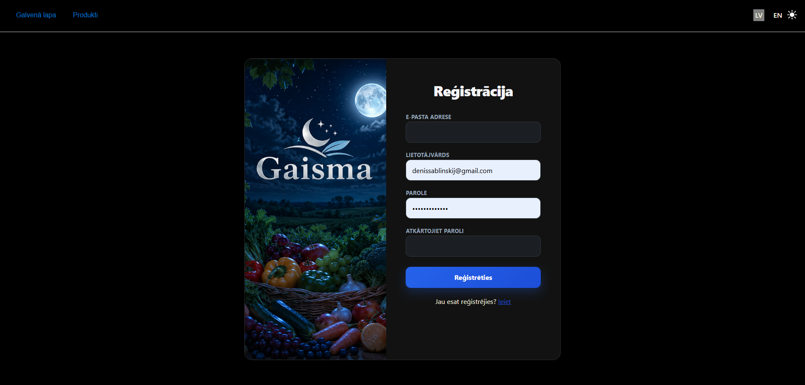
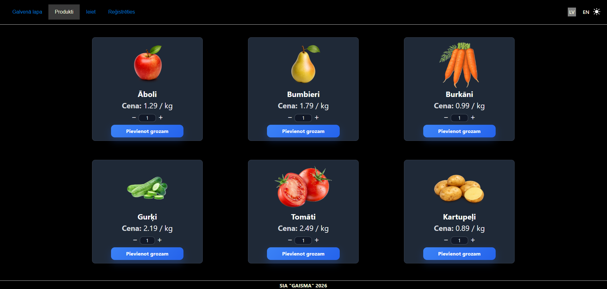
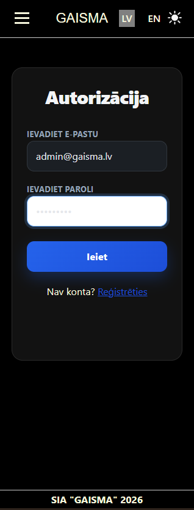
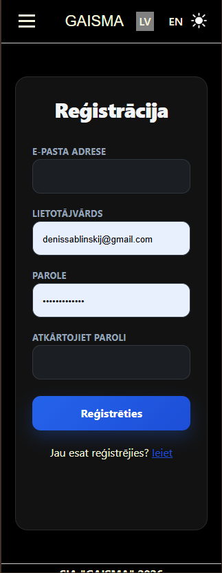
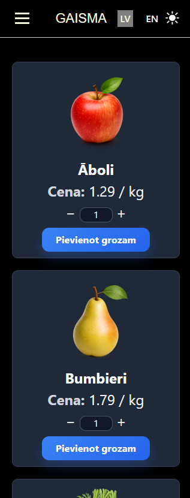

[[LV]](#latviesu) [[EN]](#english) [[Ekrānšāviņi / Screenshots]](#screenshots)

<a id="latviesu"></a>

# Pārtikas piegādes pasūtīšanas sistēma

Šis ir mācību centra "BUTS" noslēguma projekts. Projekta galvenais mērķis ir parādīt savas profesionālās projektēšanas un programmēšanas prasmes, kas tika pilnveidotas, apgūstot mācību centra kursu. Projektā tika izmantotas gan mācību centrā, gan patstāvīgi iegūtās zināšanas.

## Funkcijas

- 🔐 **Lietotāju autentifikācija un reģistrācija** – iespēja reģistrēties un autentificeties, izmantojot e-pastu un paroli.
- 📦 **Produktu saraksta pārlūkošana** – pieejamo produktu saraksts ir redzams gan reģistrētiem lietotājiem, gan vietnes viesiem.
- 🌙 **Tēmas izvēle** – lietotājs var ērti pārslēgties starp gaišo un tumšo vizuālo tēmu.
- 🌐 **Daudzvalodu atbalsts** – sistēmas saskarne ir lokalizēta un pieejama latviešu un angļu valodā.
- 📱 **Adaptīvs dizains** – saskarne ir optimizēta un ērti lietojama gan datorā, gan planšetdatorā, gan mobilajā tālrunī.

## Tehnoloģijas

- PHP
- Laravel 
- MySQL 
- Eloquent ORM 
- Blade 
- SCSS
- JavaScript

## Prasības 

1. PHP 8.2+
2. Composer
3. Node.js 20+ un npm
4. MySQL (vai cita datubāze, kas konfigurēta `.env` failā)
5. Git

## Installēšana

### 1. Projekta klonēšana

```bash
git clone https://github.com/DenissSablinskis/food-delivery-order-system.git
cd food-delivery-order-system
```
### 2. Backend atkarību instalēšana
```bash
composer install
```
### 3. .env faila izveide
```bash
cp .env.example .env
```

Windows PowerShell vidē:
```PowerShell
Copy-Item .env.example .env
```
### 4. Lietotnes atslēgas ģenerēšana
```bash
php artisan key:generate
```
### 5. Datubāzes konfigurēšana

Atjaunini šādas vērtības .env failā:
```.env
DB_CONNECTION
DB_HOST
DB_PORT
DB_DATABASE
DB_USERNAME
DB_PASSWORD
```

Izveido datubāzi pirms palaist migrācijas.
### 6. Migrāciju un seederu palaišana
```bash
php artisan migrate:fresh --seed
```
### 7. Frontend atkarību instalēšana
```bash
npm install
```
### 8. Frontend resursu izveide
```bash
npm run build
```

Ja PowerShell bloķē npm komandu, izmanto:
```PowerShell
npm.cmd run build
```
### 9. Lietotnes palaišana
```bash
php artisan serve
```
### 10. Atver lietotni pārlūkprogrammā
```
http://127.0.0.1:8000
```

## Datubāze

Sistēma sastāv no četriem Eloquent modeļiem.

- `Lietotājs`
- `Pasūtījums` 
- `Pasūtītais produkts`
- `Produkts`

Relācijas:

```text
 Lietotājs 1 ──── * Pasūtījums
 Pasūtījums 1 ──── * Pasūtītais produkts
 Pasūtītais produkts * ──── 1 Produkts
```

Šīs relācijas ir definētas Eloquent modeļos:

- `Lietotājs` hasMany `Pasūtījumi`
- `Pasūtījums` belongsTo `Lietotājs`

- `Pasūtījums` hasMany `Pasūtītie produkti`
- `Pasūtītais produkts` belongsTo `Pasūtījums`

- `Produkts` hasMany `Pasūtītie produkti`
- `Pasūtītais produkts` belongsTo `Produkts`

## Demonstrācijas konts

Lai pārbaudītu autentifikāciju, var izmantot iepriekš izveidoto testa lietotāju:

- **E-pasts:** sofija.berzina@gaisma.lv
- **Parole:** sofija1234

<a id="english"></a>

# Food Delivery Ordering System

This project is the final project for the "BUTS" training center. The main purpose of the project is to show my professional design and programming skills, which were improved during my studies at the "BUTS" training center. In this project, I used knowledge that I got in the training center and learned by myself.

## Features

- 🔐 **User authentication and registration** -  possibility to register and log in using e-mail and password.
- 📦 **Product list browsing** - the list of products is available for both registered users and guests.
- 🌙 **Theme switching** - users can switch between light and dark themes.
- 🌐 **Multilanguage support** - the system is available in Latvian and English.
- 📱 **Responsive design** - the user interface can be used on computers, tablets, or mobile phones.

## Technologies

- PHP
- Laravel 
- MySQL 
- Eloquent ORM 
- Blade 
- SCSS
- JavaScript

## Requirements

1. PHP 8.2+
2. Composer
3. Node.js 20+ and npm
4. MySQL (or another database configured in the `.env` file)
5. Git

## Installation

### 1. Clone the repository

```bash 
git clone https://github.com/DenissSablinskis/food-delivery-order-system.git
cd food-delivery-order-system
```
### 2. Install PHP dependencies
```bash
composer install
```
### 3. Create the enviromental file
```bash
cp .env.example .env
```
Windows PowerShell:
```PowerShell
Copy-Item .env.example .env
```
### 4. Generate the application key
```bash
php artisan key:generate
```
### 5. Configure the database

Update the database settings in the `.env` file:

```.env
DB_CONNECTION
DB_HOST
DB_PORT
DB_DATABASE
DB_USERNAME
DB_PASSWORD
```

Create the database before running migrations.
### 6. Run migrations and seeders
```bash
php artisan migrate:fresh --seed
```
### 7. Install frontend dependencies
```bash
npm install
```
### 8. Build frontend assets
```bash
npm run build
```
If PowerShell blocks the npm command, use:
```PowerShell
npm.cmd run build
```
### 9. Run the application
```bash
php artisan serve
```
### 10. Open in browser
```
http://127.0.0.1:8000
```

## Database

The application contains four Eloquent models:

- `User`
- `Order` 
- `OrderedProduct`
- `Product`

Relationship: 
 
```text
 User 1 ──── * Order
 Order 1 ──── * Ordered product
 Ordered product * ──── 1 Product
```

These relationships are defined in the Eloquent models:

- `User` hasMany `Orders`
- `Order` belongsTo `User`

- `Order` hasMany `Ordered products`
- `Ordered product` belongsTo `Order`

- `Product` hasMany `Ordered products`
- `Ordered product` belongsTo `Product`

## Demo Account

To test the authentication, you can use the following pre-created test account:

- **Email:** sofija.berzina@gaisma.lv
- **Password:** sofija1234


<a id="screenshots"></a>

## Ekrānšāviņi / Screenshots







